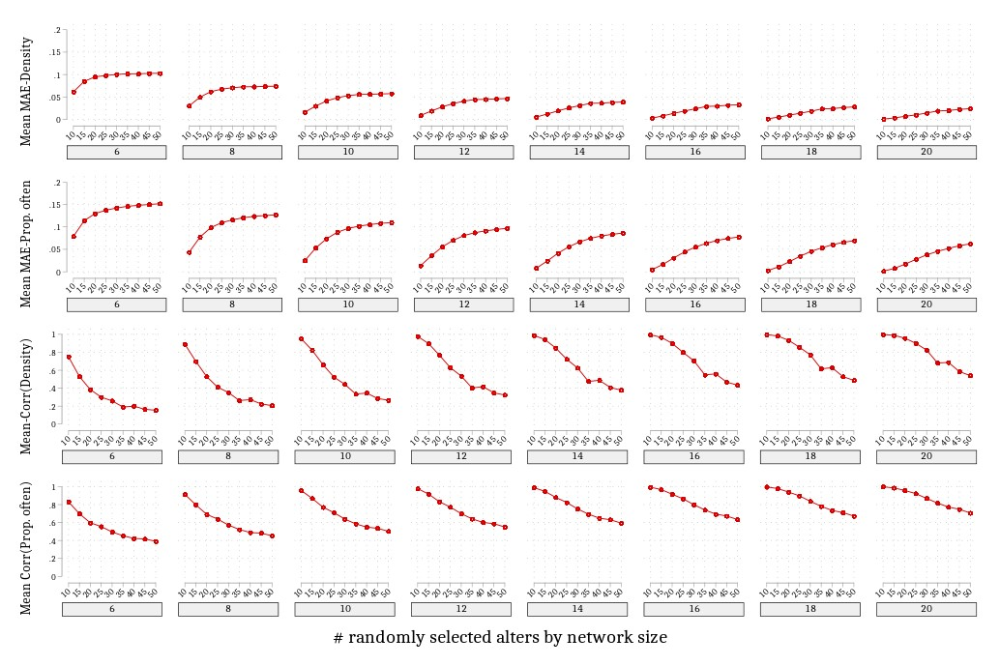

Fig. 3. Mean MAE and mean correlation for random sampling by average network size (Simulation study). Note: MAE = mean absolute error. Corr = correlation. Average network size ranged from 10 to 50 with an interval of 5. # randomly selected alters ranged from 6 to 20 with an interval of 2. Mean correlation and mean MAE were average scores for 1000 random samples per network size and number of alters selected.

Journal: Social Networks

URL: https://www.sciencedirect.com/science/article/pii/S0378873322000855?dgcid=author

Titile: Random sampling of alters from networks: A promising direction in egocentric network research

Abstract:The social network perspective has great potential for advancing knowledge of social mechanisms in many fields. However, collecting egocentric (i.e., personal) network data is costly and places a heavy burden on respondents. This is especially true of the task used to elicit information on ties between network members (i.e., alter-alter ties or density matrix), which grows exponentially in length as network size increases. While most existing national surveys circumvent this problem by capping the number of network members that can be named, this strategy has major limitations. Here, we apply random sampling of network members to reduce cost, respondent burden, and error in network studies. We examine the effectiveness and reliability of random sampling in simulated and real-world egocentric network data. We find that in estimating sample/population means of network measures, randomly selecting a small number of network members produces only minor errors, regardless of true network size. For studies that use network measures in regressions, randomly selecting the mean number of network members (e.g., randomly selecting 10 alters when mean network size is 10) is enough to recover estimates of network measures that correlate close to 1 with those of the full sample. We conclude with recommendations for best practices that will make this versatile but resource intensive methodology accessible to a wider group of researchers without sacrificing data quality.

# Instructions
For similation: 
Run "Randomization-Alter-Simulated data-varied" first, which produce results for proportion of often contact

Then run "Randomization-Simulated data-varied", which produce results for density and produce combined figures for similation

For Real-world sample: 
Run "Randomization_SNAD"

For Figure of ties by network size (Figure 1)
Run "growth of ties by netsize"
